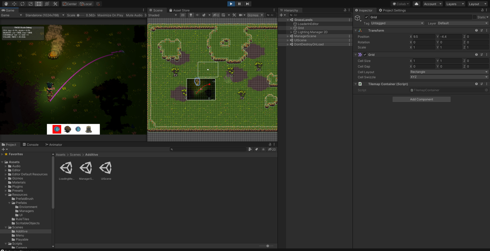

## About the Project

Catch.io is a cross-platform battle-royal catch game that focuses on stealth and traps rather than fast-paced action.
The objective of the game is to catch the other player or hide from being caught until you are the last player standing.

Certain tiles will leave a footprint, your movement will generate a soundwave that is visible to players around you, the environment that you interact with will leave a mark to announce your presence.
Players will able to know where you are, and what you've done.
But you can also use the tools that the world gives you to fake your location.
You can throw a rock to create a soundwave, you can use a teleport rune to escape from sticky situations, or you can make a sticky situation by throwing a slime ball on the ground to slow down anyone near that area.

Are you the passive type to stay away from conflict and hide in search of tools? Or are you the active type that will set up traps lure enemies and catch them?

<Row>
<Col>

</Col>
<Col>

</Col>
</Row>

## Development

Currently, Catch.io is still under active development.
You can learn more about this project from our GDD: <https://team-step.gitbook.io/catch-io-design-doc/>
