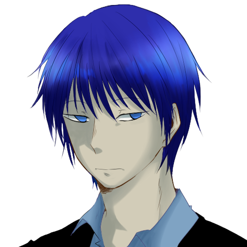

## About the Project

Esconder is a 2D top-down stealth-puzzle shooter game made with Game Maker Studio.

Our vision for this project was making a 2D version of Metal Gear Solid with advanced AI and intuitive controls for mobile devices.
Overall, we wanted to combine Hotline Miami with MGS.

We wanted to make a linear stealth-puzzle game that borrows mechanics used in action games as its tools.
Of course, we knew this was very ambitious for us, so for our development scope, we strictly focused on making an AI that can sense the player's movements, gunshots, and sense falling objects, for luring the AI. 

We kept the levels linear so that the object was much clearer to the player; go from point A to point B without being killed.
This project does have a story to it, but it was delegated to the background environment.
We wanted to focus on the game itself.

Project Esconder was showcased for the 2014 National Olympiad in Informatics, project category.
Our team won the Gold prize.

Due to several revisions made to this project, records specifically for Esconder is lost to the times.
But the remnants of this project can be found on all future projects after this one.

<Row>
<Col>

</Col>
</Row>

<Row>
<Col>

</Col>
<Col>

</Col>
</Row>

## Development

The development of Esconder started when we were toying with the idea of developing a mobile game.
We knew that RPG Maker was not capable of achieving this, and if we wanted to compete on the national stage, we needed an engine that can kickstart things fast.
That is when we worked with Game Maker Studio and GML.

Learning a new programming language was a fun task, and we already had a basic understanding of what this engine can provide us with during the prototyping stage of Palette.
So we started working on a prototype in early 2014. After a month or so, we were able to see the prototype in action.
And when we saw our game running on our phones, it felt like we were one step closer to becoming a professional game developer.

The prototype that was made was a simple twin-stick shooter with a basic enemy AI.
We understood what this engine was capable of, so we started development on this project right away.

We were given roughly half a year to work on this project if we wanted to compete in KOI.
So this time, we decided to create a rough timeline to help us stay organized during development.
Instead of using standard industry practices for project management, we used our previous records with trial and error to create a management environment.

Development went smoothly until the last month before the deadline.
There were too many bugs to fix. From this moment, the project lead/lead developer would become addicted to caffeine and suffer from sleep deprivation, which would last to this day.
But in the end, everything went well, and the project was ready to be showcased.
In late-2014, project Esconder wins the Gold prize for the national competition.

The team wanted to finish this project, but unfortunately, this was also when everyone except the project lead had to prepare to go to High school.

In 2015, Team STEP was down to a single person, and the development of project Esconder is halted.

In 2016, an aspiring composer joined the team.
We decide to revive this project under the title Project_Lookout.
The game contains most of the basic mechanics and story from Esconder, but the existing assets were removed, and the entire code was re-written from scratch for optimization.
However, due to a lack of direction and other personal reasons, this would later be halted as well.
