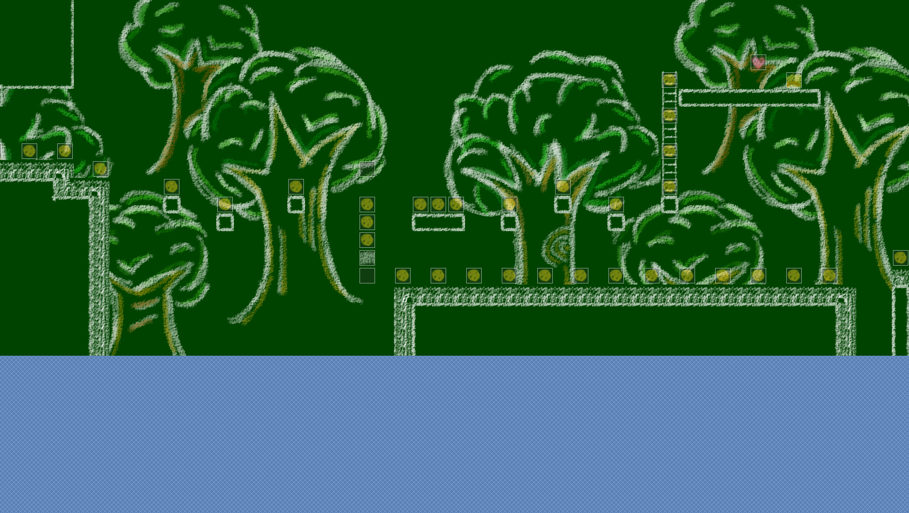
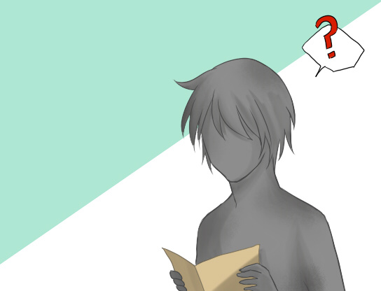
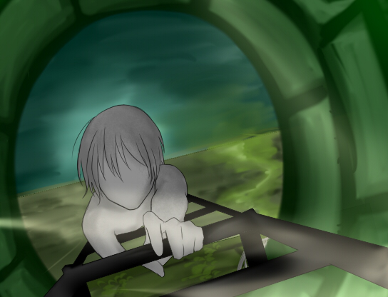
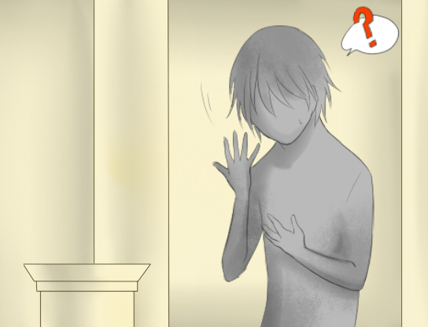

## About the Project

Palette is a 2D side-scroller game that uses the Arc Engine, a Ruby script that adds a fully-functional platform collider mask with simulated gravity to your RPG Maker VX Ace game.
It has a storybook-style visual.
Although there are no unique game mechanics, Palette tries to tell a simple story through various level themes and a "cut scene" with zero dialogue.

This game tells a story about a Gray person (named Gray) who lives in a colorful village with colorful folks.
Everyone here had vibrant colors, and they always appeared to be happy. However, Gray felt like he was out of place.
He had trouble fitting in with everyone else as his color was gray.

One day, Gray hears this magical potion called Palette.
Legends claim that this potion can find one's true colors and give happiness.

In search of this magical potion, Gray decides to go on an adventure.
Through his journey, he leaves his homeland of Crayon Land to Chalk Forest, Busy City, Sketch Land, and finally, the Sky Painting Temple, where according to the legends, Palette is.

Gray finally drinks this potion. But instead of having vibrant colors like the folks back home, he finds himself unchanged. Gray was still gray.
Feeling disappointed, Gray leaves the temple and tries to head back home, empty-handed.
But when he looked back at the path and the journey he went through, Gray realized that the world was much bigger than he thought.
He knew that not all places are filled with colorful folks.
Gray started to believe that maybe gray is his true color.
He was always who he was.
With this realization, Gray decides to head back home, but this time, with a lighter heart.

And the game ends.

<Row>
<Col>

</Col>
</Row>

<Row>
<Col>

</Col>
<Col>

</Col>
<Col>

</Col>
</Row>

## Development

Palette had a very short pre-production stage, as the team already knew that it would be a 2D platformer with some unique styles, but nothing more than that.
The team wanted to create a game that can be showcased for the regional programming competition (official name was Olympiad in Informatics).
So we made the game less story-heavy and more playable.

The development of Palette started in early-2014.
During its early development phase, the team tried making it with GameMaker 8.
But after several attempts, we found that it was hard for pure-level designing and the engine required too many boilerplates for small and inexperienced developers.
That was when we decided to move back to RPG Maker VX Ace and find a way to make a 2D platformer out of that system.
Hence how we got to modify the RPG Maker engine itself and learn Ruby along the way.

After roughly two months of work, we finished the prototype that was ready to be showcased.
We were able to get the silver prize and earn the right to compete in the national competition thanks to this project.
After the competition, we decide to finish this project and release it to the world.
We already completed most of the heavy tasks, so all we had to do was add more worlds and an ending cut scene, plus some bug fixes.
In September of 2014, we officially released Pallete through our online blog and asked our friends at school to play this.
It had a small user base, but people who played the game loved it.
The team was getting genuine feedback and support from our friends and strangers on the internet.
Palette may be the first (and currently, the only) project that Team STEP finished with a proper ending.
