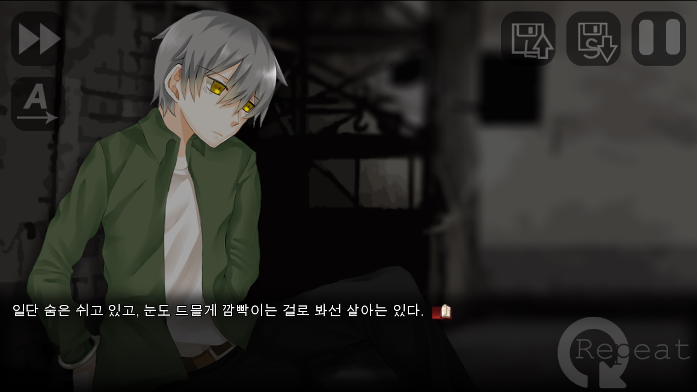
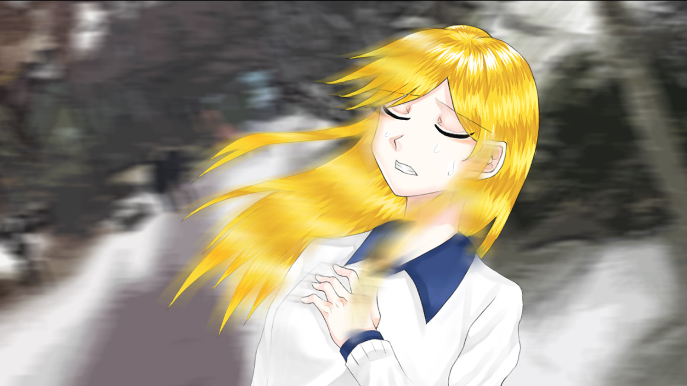
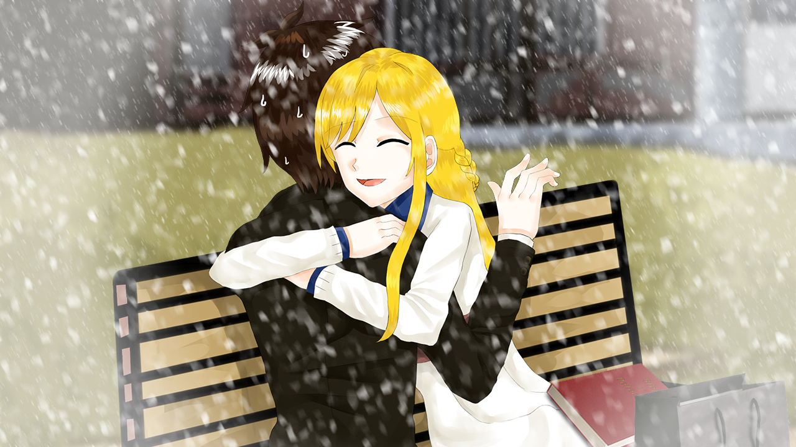
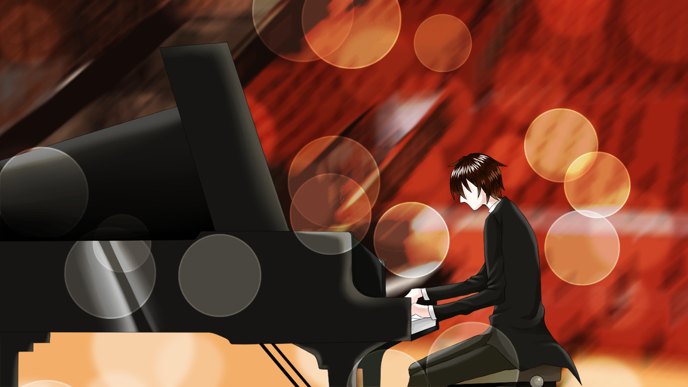
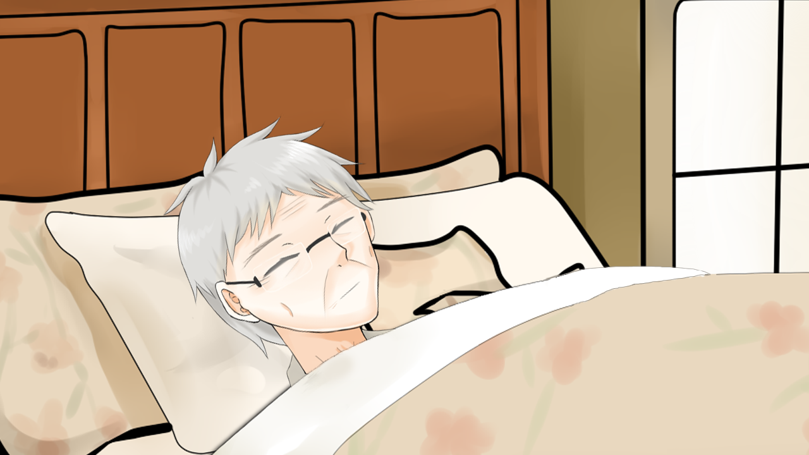
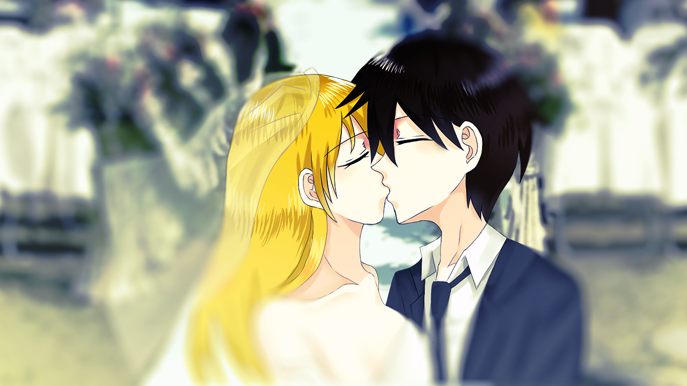
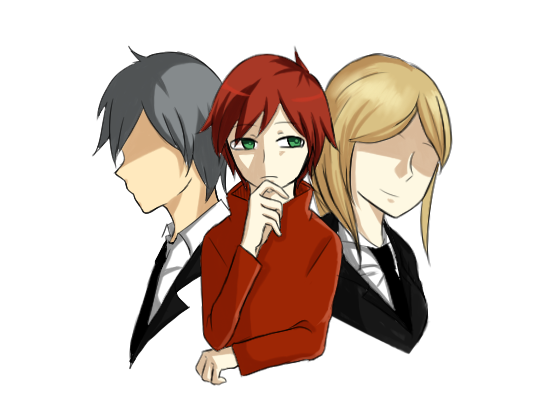
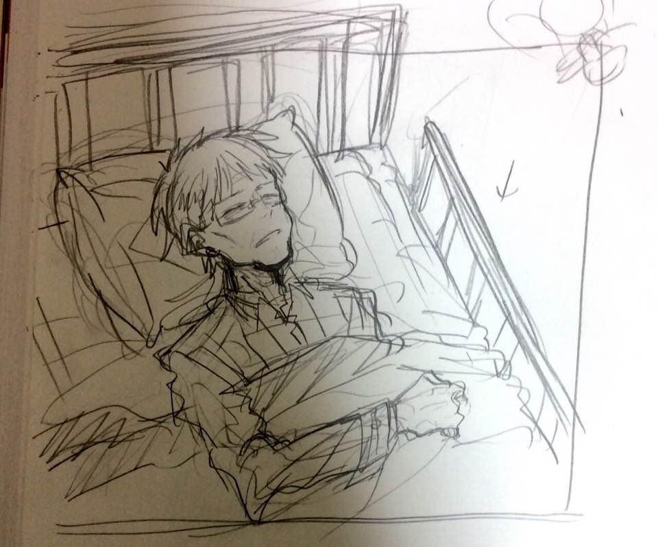
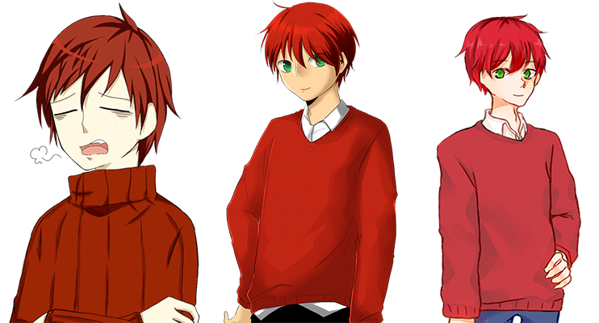

## About the Project

Repeat is a story-driven point-and-click adventure/visual novel that tells a story that lasts for generations.
The story starts from the perspective of Stephan Tomer, a teen struggling to find purpose in his life.
One day, he receives a call from his grandfather, who tells him about his recent discovery in the house.
It was an old safe behind the wall tile that he never knew it was there, seemingly hiding something that his wife mentioned decades ago before her early death.
Interested by this discovery, Stephan goes on an "adventure" of going through his grandfather's diaries and other historical sources to understand how his grandfather and grandmother met, lived in their youths.
As the story progresses, we find out that there were regretful decisions made by Stephan's grandfather and other signs that show a greater conspiracy behind this event.

Due to the long development period, currently, this is the most well-documented project from Team STEP.

<Row>
<Col>

</Col>
<Col>

</Col>
<Col>

</Col>
</Row>

<Row>
<Col>

</Col>
<Col>

</Col>
<Col>

</Col>
</Row>

## Development

The pre-production for project Repeat started in late 2012.
Inspired by popular RPG maker games like To the Moon and Mad Father, we initially started this project from RPG Maker VX with a team of three people.
At first, the project was called Reverse.

<Row>
<Col>

</Col>
<Col>

</Col>
</Row>

Active development started from 2013 until early 2014.
The remnants of this work can still be found on our cloud drive.
However, in 2014, we ceased all development for Reverse as there was a regional programming competition (junior-high).
We found out that this also had a category for "software," which allowed students to showcase what they made.
Because a story-driven game is hard to explain and showcase to the judges, we decided to work on a different project on the same engine.

<Row>
<Col>

</Col>
</Row>

Late-2014, we revive this project with a fresh mind and a new engine.
We changed everything, from the title (this was when we changed it to Repeat) to the game genre.

The team decided to develop the project from Ren'Py, a visual novel engine written in Python.
We created all the art assets from scratch and added more content that was not in the original game.
However, this was when the lead character artist dropped out of the team.
Thus, the character style had to change, hopping from artist to artist.
In 2015, we finished the game's overall story, including most of the art assets.

Early-2016, because we could not create a consistent script for the game, it seemed like the project was going on an endless cycle.
We did not have any game design documents or a finished script.
We only had a general storyboard and a vague concept for everything, which meant the team had to make everything as we went on.
After this realization, the team (only a single person left at the time) had to put Repeat in indefinite hideous.
As of now, we do not have any official plans to start this project. But we don't want to let it die just yet.
