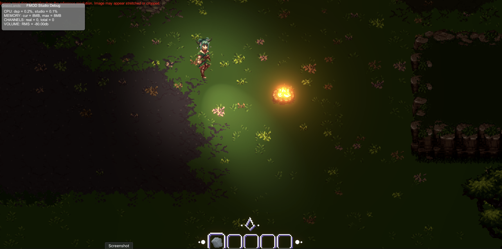
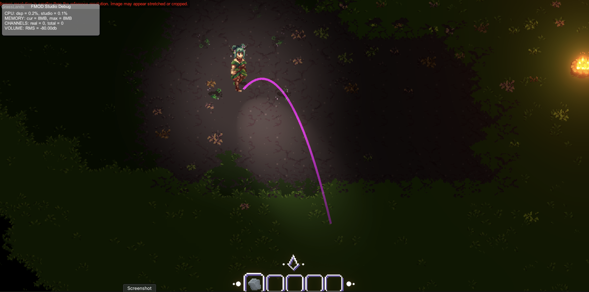
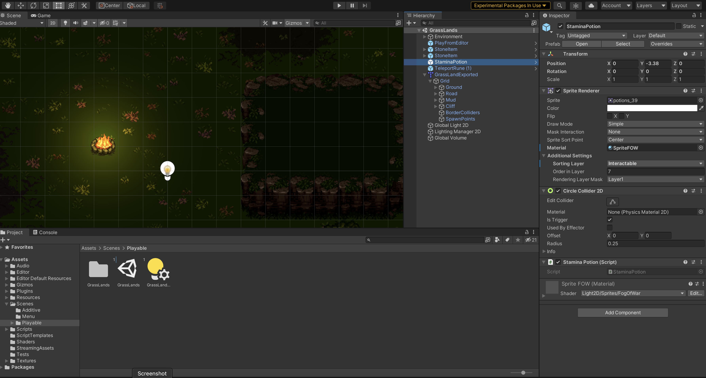
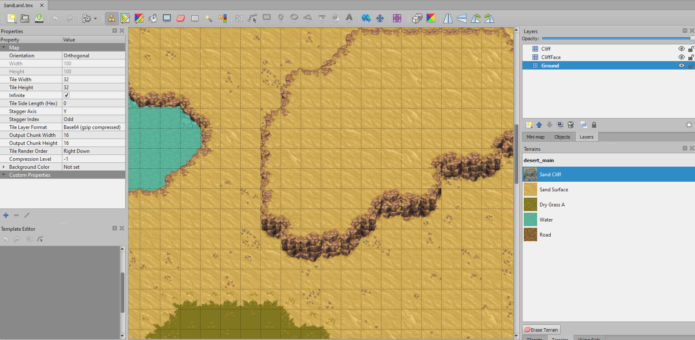

<https://gdd.witchone.io/>

<https://witchone.io/>

## About the Project

Witch One is an indie online rotative asymmetric hide-and-seek game.
The objective of the game is to be the last player standing from a 15 player randomized round of hide-and-seek.
Players can find various items like stones, teleport runes, slime eggs, and others that can help them incapacitate other players or escape from a sticky situation.

The game will randomly choose a "Cursed One" who has to catch a player before the timer runs out.
Once the Cursed One catches a player, the caught player will get a game over and a different player will be chosen as the new Cursed One.
This process of killing and randomly choosing the Cursed One will repeat until there is only one player left in the game.

## Game Environment

Witch One puts the player in a dark environment where every movement will announce your location or allow others to look at your tracks to find you.

Certain surfaces in the game can leave a footprint when the player walks on top of it.
This footprint will be in the game until the player gets a game over.
Depending on your movement state such as running or walking, your movement can generate a visible sound wave that is visible to players.

But you can also use the tools and items scattered throughout the world to your advantage.
You can throw a rock to create a sound wave, you can use a teleport rune to escape from sticky situations, or you can make a sticky situation by throwing a slime egg which will create a slimy surface that will slow down anyone on top.

<Row>
<Col>

</Col>
<Col>

</Col>
</Row>

## Development

Development started from March of 2020 and it is still under active development.

<Row>
<Col>

</Col>
<Col>

</Col>
</Row>
